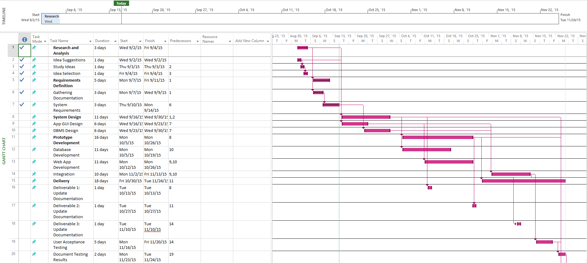

#Hoppa: Master Project Development Plan
##Project Team
Keysha M. González Colón, Rolando C. Ortiz Santiago, Yanisse M. Rodríguez Torres

##Project Purpose

The purpose for this project is to develop a web application called Hoppa. Hoppa is a social network where college students  will be able to provide and receive assistance with the courses they are struggling with, creating or joining Study Groups where they can solve exercises, post unanswered exercises for assistance, etc. 
Project Objectives
The main objective of this project is to connect students around the world by the courses and assistance they need.

The selected development frameworks are:
*AngularJS
*Flask Framework
*PostgresSQL   

This project has 6 phases:
*Sprint 0: Conceptual Design and Development Plan
*Sprint 1: App GUI Design and DBMS instance
*Sprint 2,3,4,5: Open

Hoppa will connect users-through the internet- with a username and password they have created, allowing users to share their doubts, answer questions and communicate with other users in the network. Every user will have a profile in which he can complete with information such as his name, location, achievements and education. The users could also, be friends with other users, be members of groups, follow business pages, and set if they will assist to events. To show the latest posts, such as media and/or messages, by the preferences of the user Hoppa will have a news feed. The information displayed in the newsfeed will be by the most recent to the earliest. As a functionality posts and events relate to the user will be notified to him by email.

##Project Scope
This project will allow college students to access a social network where they will be able to provide and receive assistance with courses they are struggling with, creating or joining Study Groups where they can solve exercises, post unanswered exercises for assistance, etc. These groups can be created for any topic, such as math, science, history, among others. Though not exclusively usable by only students, students are the intended audience and the network will be based around their use. This service will connect students in order to help them provide mutual aid. Through this service, students will have a more personal support when searching for help with homework, study exercises, group study meetings and the like. It will also allow students to corroborate the solutions found by communicating with their peers directly and being able to leave a review of how well they like a given solution. Based on these reviews and how many problems they help solve, users will be given a certain rank. All users start out as an Egg and by helping others move up through the ranks of Tadpole, Tadpole with Legs, Tailed Frog, Adult Frog, and Elder Frog.

##Out of Scope
Hoppa will not support video or voice chat. It will also be a web app and is currently not planned to have mobile support in its first version.
When faced with a troublesome problem, most students will turn to the internet or their friends for help. Unfortunately, they may not always find the solution online, or they may find but not understand it. Furthermore, they may not have a means by which to contact all their friends, or they may not feel comfortable asking some of them for help out of the blue. Hoppa will solve both of these problems. While not guaranteeing a solution to your problem, it will allow you to obtain help from any Hoppa friend willing to come to your aid, or your fellow group members. If someone manages to solve your problem and you don’t understand the solution, you need only ask them to clarify.

##Success Criteria

The first phase sprint 0 (Conceptual Design and Development Plan) of the project will be a success when:
*application concept and name is created
*all development frameworks are selected and functional
*E-R diagram is designed
*Requirements Definition Document is completed
*Intellectual Property Agreement is written

The second phase sprint 1 (App GUI Design and DBMS instance) of the project will be a success when:
*Updated version of Master Project Plan and Gant chart are realized
*Project Development Plan is realized for the phase
*App mocks are created
*ER Mapping and working DBMS is hosted somewhere on the cloud

The third, fourth, fifth and sixth phase (Open) of the project will be a success when:
*final update with percent completion for each sprint
*updated Project Development Plan
*project completion

##Milestones

